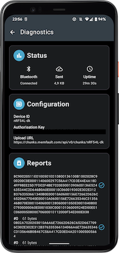

# Android Memfault Library

An Android library that can connect to a Bluetooth LE device, download diagnostics data and upload them to [the Memfault console](https://docs.memfault.com).

The device should contain characteristics defined in [the Memfault documentation](https://docs.memfault.com/docs/mcu/mds).

## Example usage

```kotlin
val manager = MemfaultDiagnosticsManager.create(context)

// Receive status and data:
manager.state.collect {
    // [...]
}

// Connect and start observing diagnostics data:
manager.connect(peripheral, centralManager) // Using Kotlin BLE Library
// or
manager.connect(context, device) // Using the legacy code

// When finished:
manager.disconnect()
```

## Documentation

Dokka documentation can be found [here](https://nordicsemiconductor.github.io/Android-Memfault-Library/html/index.html).

## Application

<a href='https://play.google.com/store/apps/details?id=no.nordicsemi.memfault'></a>

  

## Library

The library is available on Maven Central repository. Add it to your project by adding the following dependency:

```Groovy
implementation 'no.nordicsemi.android:memfault-observability:2.0.1'
```

## Dependencies
Application under the hood uses:
1. [Kotlin BLE Library](https://github.com/NordicSemiconductor/Kotlin-BLE-Library) - for managing BLE connection and reading data from the remote device.
2. [MemfaultCloud Android](https://github.com/memfault/memfault-cloud-android) - for uploading chunks to the cloud.
